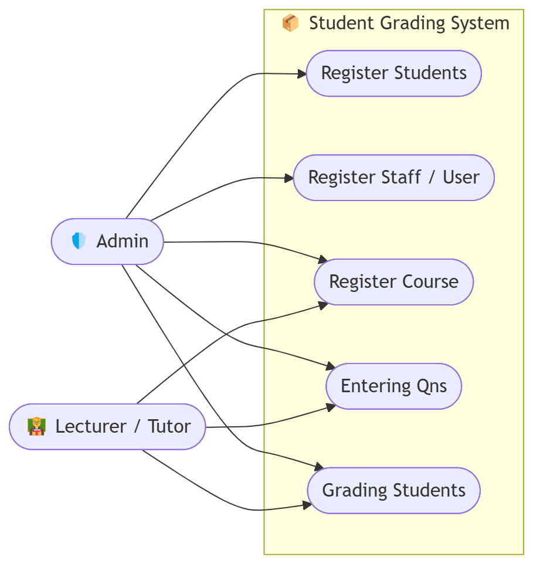
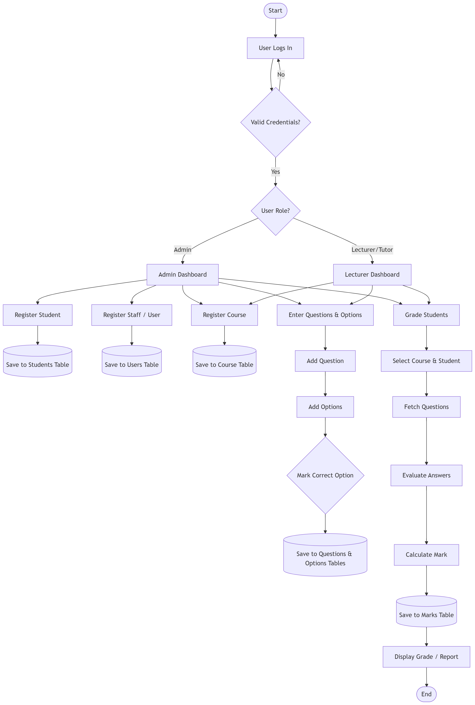
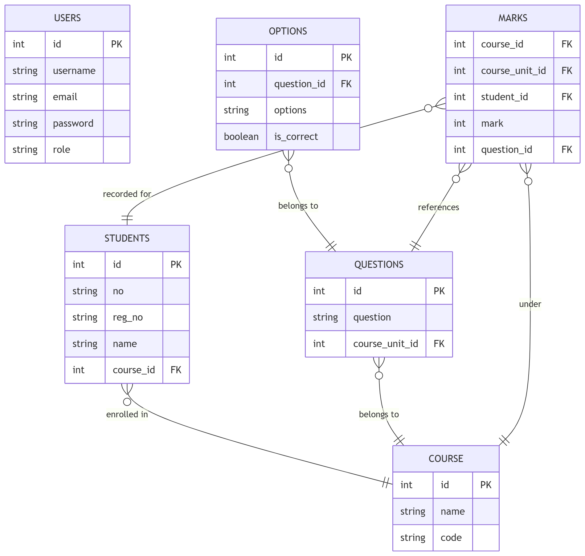

# 📝 AutoGrader

> A mobile-based MCQ AutoMarker system for university assessments automating the grading of multiple-choice questions, reducing lecturer workload, and delivering instant student feedback.


---

## 📚 Table of Contents

- [About the Project](#about-the-project)
- [Features](#features)
- [System Architecture](#system-architecture)
- [Tech Stack](#tech-stack)
- [Getting Started](#getting-started)
  - [Prerequisites](#prerequisites)
  - [Installation](#installation)
  - [Environment Variables](#environment-variables)
  - [Running the App](#running-the-app)
- [Project Structure](#project-structure)
- [Database Schema](#database-schema)
- [System Diagrams](#system-diagrams)
- [API Documentation](#api-documentation)
- [User Roles](#user-roles)
- [Contributing](#contributing)
- [Team](#team)
- [License](#license)

---

## 📖 About the Project

**AutoGrader** is a mobile application developed to automate the grading of hard-copy Multiple Choice Question (MCQ) answer sheets in university settings. Lecturers currently spend several hours manually grading answer sheets, a process that is error-prone and delays feedback to students.

AutoGrader addresses this problem by providing a digital platform where:
- **Admins** manage students, staff, and courses
- **Lecturers** enter exam questions with answer options and grade students instantly
- Results and performance analytics are stored and accessible in real time

The system targets universities and higher institutions, serving as a low-cost, accessible alternative to expensive commercial grading solutions.

---

## ✨ Features

**Admin**
- Register and manage students
- Register and manage staff/users
- Register and manage courses

**Lecturer / Tutor**
- Enter MCQ questions and answer options
- Mark correct answers per question
- Select a course and student to grade
- Automatically evaluate answers and calculate marks
- View and export grade reports

**System**
- Role-based authentication (Admin & Lecturer)
- Secure JWT-based login
- Real-time score calculation
- Performance analytics per student and course
- Clean and intuitive mobile UI

---

## 🏗️ System Architecture

The system follows a **client-server architecture**:

```
[ React Native Mobile App ]
           |
           | REST API (HTTP/HTTPS)
           |
[ Node.js + Express Backend ]
           |
           | SQL Queries
           |
      [ MySQL Database ]
```

- The **mobile frontend** handles UI, camera input, and user interactions
- The **backend API** processes business logic, authentication, and grading
- The **MySQL database** stores users, students, courses, questions, options, and marks

---

## 🛠️ Tech Stack

| Layer | Technology |
|---|---|
| Mobile Frontend | React Native (Expo) + TypeScript |
| Navigation | Expo Router |
| Backend | Node.js + Express.js |
| Database | MySQL |
| Authentication | JWT (JSON Web Tokens) |
| API Communication | REST API (Axios) |
| Package Manager | Yarn (frontend) / npm (backend) |

---

## 🚀 Getting Started

### Prerequisites

Make sure you have the following installed:

- [Node.js](https://nodejs.org) (v18 or higher)
- [Yarn](https://yarnpkg.com)
- [MySQL](https://www.mysql.com) (v8 or higher)
- [Expo Go](https://expo.dev/client) on your mobile device
- Git

### Installation

**1. Clone the repository**

```bash
git clone https://github.com/YourUsername/AutoGrader.git
cd AutoGrader
```

**2. Install frontend dependencies**

```bash
cd mobile
yarn install
```

**3. Install backend dependencies**

```bash
cd ../backend
npm install
```

**4. Set up the MySQL database**

```bash
mysql -u root -p
```

```sql
CREATE DATABASE autograder_db;
USE autograder_db;
SOURCE database/schema.sql;
```

### Environment Variables

**Backend — create a `.env` file inside the `/backend` folder:**

```env
PORT=5000
DB_HOST=localhost
DB_USER=root
DB_PASSWORD=your_mysql_password
DB_NAME=autograder_db
JWT_SECRET=your_jwt_secret_key
JWT_EXPIRES_IN=7d
```

**Mobile — create a `.env` file inside the `/mobile` folder:**

```env
API_BASE_URL=http://your-local-ip:5000/api
```

> ⚠️ Replace `your-local-ip` with your machine's local IP address (e.g., `192.168.1.5`) so your phone can reach the backend over WiFi.

### Running the App

**Start the backend server:**

```bash
cd backend
npm run dev
```

**Start the mobile app:**

```bash
cd mobile
yarn start
```

Then scan the QR code with **Expo Go** on your phone. Make sure your phone and computer are on the **same WiFi network**.

---

## 📁 Project Structure

```
AutoGrader/
├── mobile/                   # React Native (Expo) frontend
│   ├── app/                  # Screens using Expo Router
│   │   ├── (auth)/           # Login screens
│   │   ├── (admin)/          # Admin dashboard & screens
│   │   └── (lecturer)/       # Lecturer dashboard & screens
│   ├── components/           # Reusable UI components
│   ├── services/             # API call functions (Axios)
│   ├── constants/            # Colors, config, etc.
│   ├── assets/               # Images, fonts
│   └── app.json              # Expo config
│
├── backend/                  # Node.js + Express API
│   ├── controllers/          # Route handler logic
│   ├── routes/               # API route definitions
│   ├── middleware/           # Auth middleware (JWT)
│   ├── models/               # Database query functions
│   ├── config/               # DB connection config
│   └── server.js             # Entry point
│
├── database/
│   └── schema.sql            # MySQL schema
│
└── README.md
```

---

## 🗄️ Database Schema

The database consists of the following tables:

| Table | Description |
|---|---|
| `USERS` | Stores admin and lecturer accounts with roles |
| `STUDENTS` | Stores student details linked to a course |
| `COURSE` | Stores course names and codes |
| `QUESTIONS` | Stores MCQ questions per course unit |
| `OPTIONS` | Stores answer options per question with correct flag |
| `MARKS` | Stores calculated marks per student, course, and question |

**Key Relationships:**
- A `STUDENT` is enrolled in a `COURSE`
- A `QUESTION` belongs to a `COURSE`
- An `OPTION` belongs to a `QUESTION` and flags the correct answer
- `MARKS` reference a `STUDENT`, `COURSE`, and `QUESTION`

---

## 📊 System Diagrams

### Use Case Diagram


### System Flowchart


### Entity Relationship (ER) Diagram


---

## 📡 API Documentation

### Auth

| Method | Endpoint | Description | Access |
|---|---|---|---|
| POST | `/api/auth/login` | Login user and return JWT token | Public |

### Users

| Method | Endpoint | Description | Access |
|---|---|---|---|
| GET | `/api/users` | Get all users | Admin |
| POST | `/api/users` | Register a new staff/user | Admin |
| DELETE | `/api/users/:id` | Delete a user | Admin |

### Students

| Method | Endpoint | Description | Access |
|---|---|---|---|
| GET | `/api/students` | Get all students | Admin, Lecturer |
| POST | `/api/students` | Register a new student | Admin |
| GET | `/api/students/:id` | Get student by ID | Admin, Lecturer |
| DELETE | `/api/students/:id` | Delete a student | Admin |

### Courses

| Method | Endpoint | Description | Access |
|---|---|---|---|
| GET | `/api/courses` | Get all courses | Admin, Lecturer |
| POST | `/api/courses` | Register a new course | Admin |
| DELETE | `/api/courses/:id` | Delete a course | Admin |

### Questions & Options

| Method | Endpoint | Description | Access |
|---|---|---|---|
| GET | `/api/questions/:courseUnitId` | Get questions for a course unit | Lecturer |
| POST | `/api/questions` | Add a new question with options | Lecturer |
| DELETE | `/api/questions/:id` | Delete a question | Lecturer |

### Grading / Marks

| Method | Endpoint | Description | Access |
|---|---|---|---|
| POST | `/api/marks/grade` | Grade a student and save marks | Lecturer |
| GET | `/api/marks/:studentId` | Get marks for a student | Admin, Lecturer |
| GET | `/api/marks/report/:courseId` | Get full course grade report | Admin, Lecturer |

> All protected routes require the `Authorization: Bearer <token>` header.

---

## 👥 User Roles

### Admin
- Full access to the system
- Registers students, staff, and courses
- Cannot grade students directly

### Lecturer / Tutor
- Can register courses and enter questions
- Grades students by selecting a course and evaluating answers
- Views grade reports and analytics

---

## 🤝 Contributing

We welcome contributions! Please follow the steps below:

**1. Fork the repository**

Click the **Fork** button on the top right of this page.

**2. Clone your fork**

```bash
git clone https://github.com/YourUsername/AutoGrader.git
cd AutoGrader
```

**3. Create a new branch**

```bash
git checkout -b feature/your-feature-name
```

**4. Make your changes and commit**

```bash
git add .
git commit -m "feat: add your feature description"
```

**5. Push to your branch**

```bash
git push origin feature/your-feature-name
```

**6. Open a Pull Request**

Go to the original repository and click **New Pull Request**.

### Commit Message Convention

Please follow this format:

```
feat: add new feature
fix: fix a bug
docs: update documentation
style: formatting changes
refactor: code restructuring
test: add or update tests
```

### Code Style
- Use **TypeScript** on the frontend
- Use **ESLint + Prettier** for formatting
- Keep functions small and well-named
- Comment complex logic

---

## 👨‍💻 Team

| Name | Reg No | Role |
|---|---|---|
| Oryema Walter | 23/U/2258/GIM/PS | Team Lead / Developer |
| Ategeka Racheal | 23/U/3984/GIM | Developer |
| Asaba Godfrey | 23/U/2197/GIM/PS | Developer |

**Institution:** Gulu University — Department of Computer Science
**Supervisor:** *(Name to be added)*
**Academic Year:** 2025/2026

---

## 📄 License

This project is licensed under the **MIT License** — see the [LICENSE](LICENSE) file for details.

---

<p align="center">Built with ❤️ by Group 08 — Gulu University</p>